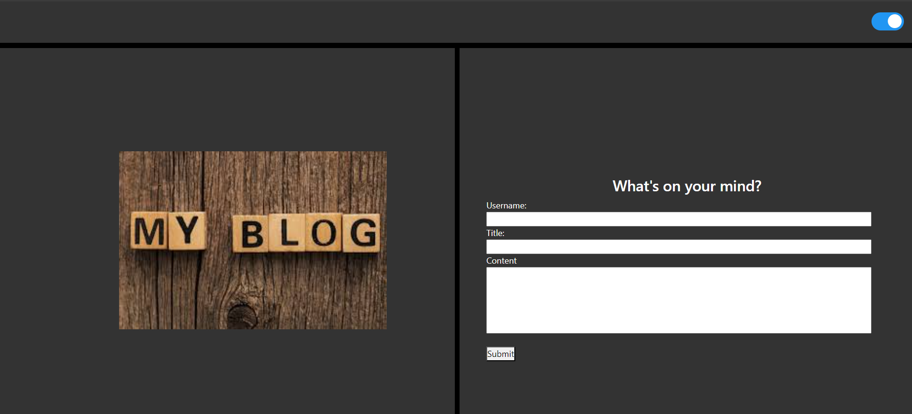
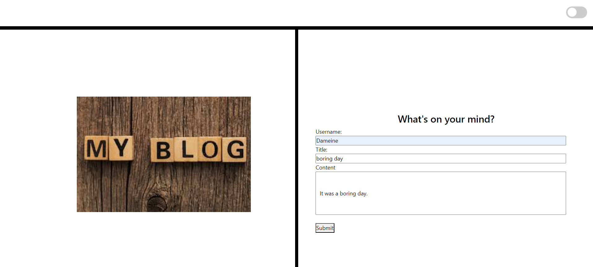
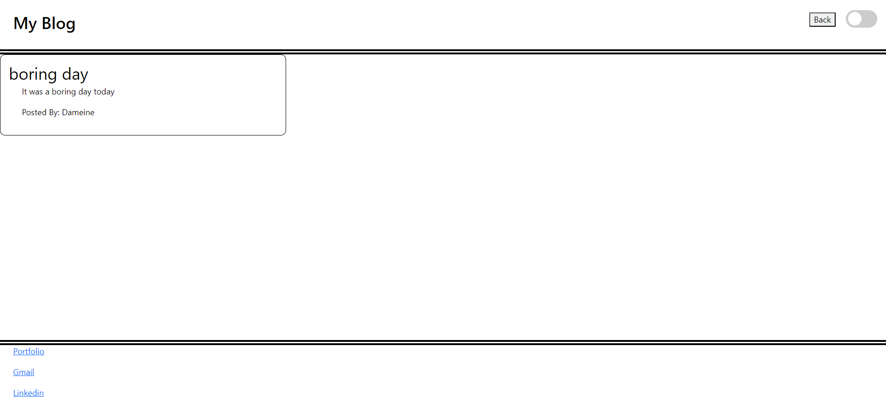
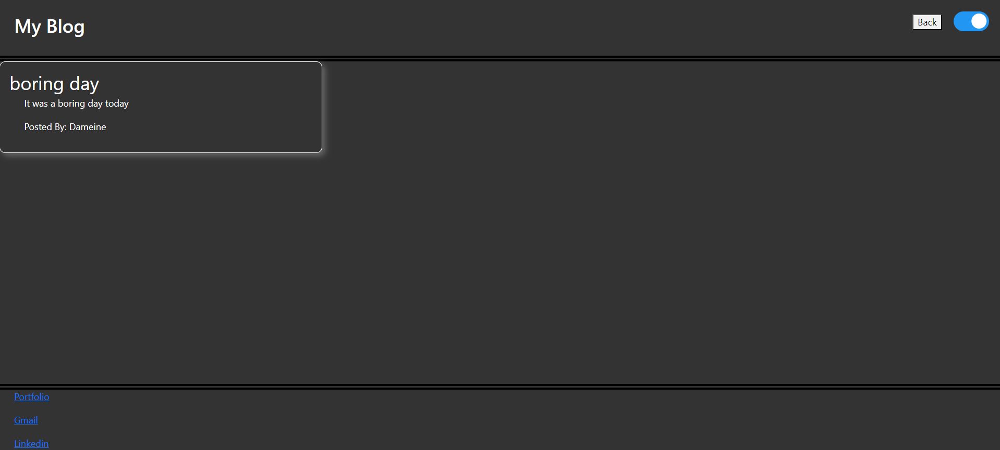

# Personal Blog

## Description

The reason for creating this blog page is for a user to create blog post. While creating this website I learned how to store user input in the local storage. Also I learned how to make buttons jump to different html pages. Dynamically creating divs with javascript was tricky as well as light/dark toggle.

## Installation

N/A

## Usage

To use this blog website enter in the user's name in username input box, then provide a title for the blog. Lastly the user can put in the blog content into the content input box. If these are left blank then the user will get an alert letting the user know that they must fill out the fileds before clicking submit. Once submitted the user will be directed to a blog page where the user's blog will be posted. In the top right corner is a back button to bring the user back to the blog input page. There is also a light/dark toggle in the top right corner as well.

## Deployed Links
website: https://dameine.github.io/Weather-Dashboard-challenge-06/

github repo: https://github.com/Dameine/Weather-Dashboard-challenge-06

## Snapshots

